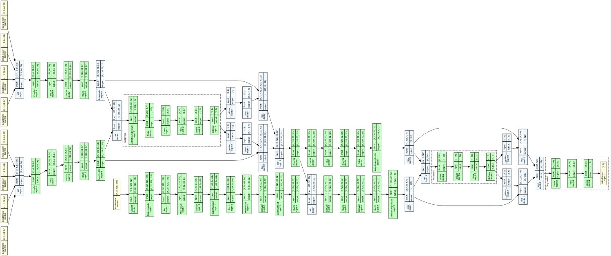
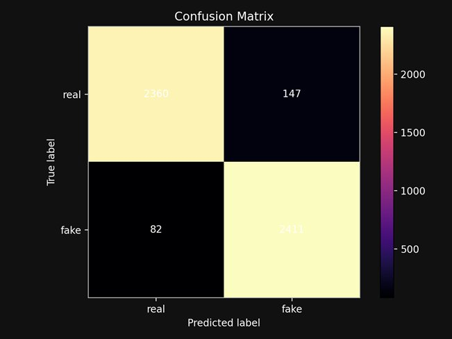
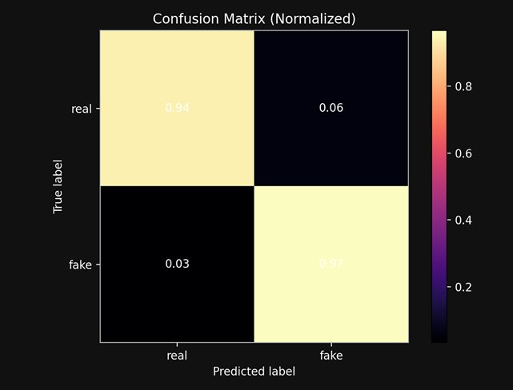

# DeepTrace — AI Deepfake Detection
Made By Phillip Rzeszotko and Michal Domanski

> CNN-based image forensics system for detecting AI-generated and deepfake imagery.  
> The current model achieves **95.4% accuracy on unseen GAN-generated images** despite being trained only on Stable Diffusion outputs — demonstrating real cross-generator generalisation.

---

## The Story

Three models were developed and compared during this project:

| Stage | Model | Training Data | Purpose |
|---|---|---|---|
| Baseline 1 | **SVM** (HSV / FFT / Wavelet features) | GAN images | Classical handcrafted-feature baseline |
| Baseline 2 | **SimpleCNN** (2 conv layers) | GAN images | Lightweight deep-learning baseline |
| Final | **WaveletHybridNet** (RGB + Wavelet branches) | Stable Diffusion v1.5 only | Production model |

The headline result: the final WaveletHybridNet — **trained on a completely different generator family** (diffusion) — still reaches ~94% accuracy on the GAN test set it was never exposed to during training. The frequency-domain artifacts captured by the wavelet branch generalise across generator architectures.

---

## SVM Baseline (Trained on GAN)

Before deep learning, classical SVMs were evaluated across handcrafted feature combinations on 40,000 GAN-generated training images (20k real, 20k fake):

| Features | Test AUC | Test F1 |
|---|---|---|
| HSV only | 0.580 | 0.588 |
| FFT only | 0.637 | 0.607 |
| Wavelet only | 0.658 | 0.627 |
| FFT + Wavelet | **0.719** | **0.673** |
| HSV + FFT + Wavelet | 0.726 | 0.673 |

FFT + Wavelet features produced the best trade-off — confirming that frequency-domain information is the most discriminative signal for distinguishing generated imagery from real photographs. This finding directly motivated the WaveletHybridNet architecture.

---

## SimpleCNN Baseline (Trained on GAN)

A lightweight two-layer CNN was trained as a deep-learning baseline on the same GAN dataset:

| Layer | Details |
|---|---|
| Conv1 | 3 → 16 channels, 3×3, ReLU, MaxPool |
| Conv2 | 16 → 32 channels, 3×3, ReLU, MaxPool |
| FC | Flatten → 128 → 2 |
| Input | 224×224 RGB |

SimpleCNN outperformed the SVM but learned only surface-level pixel patterns. It struggled to generalise outside its training distribution, which motivated the move to a frequency-aware hybrid architecture.

---

## WaveletHybridNet (Final Model)

Due to disk space constraints (the full multi-generator dataset exceeded 200 GB), v2 training was limited to **Stable Diffusion v1.5** imagery only. Crucially, the resulting model was then evaluated on the GAN test set and achieved **95.4% accuracy** despite never seeing a single GAN image during training.

The model processes each input through two parallel branches, fused by a learned attention mechanism. The full computational graph is shown below:

<p align="center">
  
</p>

**High-level overview:**

```
Input Image (128×128)
        │
        ├──────────────────────────────────┐
        ▼                                  ▼
  RGB Branch                       Wavelet Branch (db4, 2 levels)
  Conv(3 → 32)  + BN + Pool         ┌─ Level 1: LL₁ LH₁ HL₁ HH₁
  Conv(32 → 64) + BN + Pool         └─ Level 2: LL₂ LH₂ HL₂ HH₂
  Conv(64 → 128) + BN                            │
        │                              Level Attention
        │                              (learns which wavelet level matters)
        │                                          │
        └────────── Residual Fusion ────────────────┘
                          │
                  RGB Refinement × 2
                  Wav Refinement × 2
                          │
                  Global Average Pool
                          │
                  Final Attention (RGB vs Wav fusion)
                          │
                  FC(128 → 64) → FC(64 → 2)
                          │
                     REAL / FAKE
```

The wavelet branch decomposes the image using a **Daubechies db4** wavelet at two levels, extracting the high-frequency subbands (LH, HL, HH) that encode the subtle compression and generation artifacts left by AI generators — signals largely invisible to a standard RGB CNN.

**Training configuration:**
| Parameter | Value |
|---|---|
| Optimiser | AdamW |
| Learning rate | 1 × 10⁻⁴ |
| Weight decay | 1 × 10⁻⁴ |
| Batch size | 8 |
| Input size | 128 × 128 |
| Wavelet | db4, 2 levels |
| Validation | 2-fold cross-validation |
| Early stopping | patience = 3 |

### Performance — Confusion Matrix

Tested on the unseen GAN dataset (the same data used to train the baselines, never shown to WaveletHybridNet during training):

<p align="center">
  
  &nbsp;
  
</p>

| Metric | Value |
|---|---|
| Overall accuracy | **95.4%** |
| Real → correctly identified | 94% (2360 / 2507) |
| Fake → correctly identified | 97% (2411 / 2493) |
| False positives (real flagged as fake) | 147 |
| False negatives (fake flagged as real) | 82 |

Despite never seeing a single GAN image during training, the model correctly classifies 94% of real photographs and 97% of GAN-generated fakes. The frequency-domain artifacts captured by the wavelet branch are clearly transferable across generator families.

Detailed per-epoch loss curves and validation metrics are recorded in `ML/wavelet_cnn/runs/wavelet_graph/` — viewable with `tensorboard --logdir ML/wavelet_cnn/runs`.

The model performs best on **portrait / headshot images**. AI-generated scenes and non-face content fall outside the training distribution and may produce less reliable verdicts.

---

## Web Architecture

The browser interface runs as a Spring Boot application on `localhost:8080`. Image uploads travel over HTTP as `multipart/form-data`, are written to a temp file by the Java controller, passed to the Python inference script via a subprocess, and the JSON result is returned as an HTTP response rendered live in the browser.

```
Browser  ──[HTTP POST multipart]──▶  Spring Boot (Java 17)
                                            │
                                     saves temp file
                                            │
                                   ProcessBuilder subprocess
                                            │
                                     infer_v2.py
                                     WaveletHybridNet
                                     RGB + Wavelet branches
                                            │
                                       JSON stdout
                                            │
Browser  ◀──[HTTP JSON response]────────────┘
```

---

## Future Work

The current WaveletHybridNet was trained on Stable Diffusion v1.5 only due to disk capacity limits. The next iteration of the training collective will be expanded to cover a broader range of generators:

- **DALL·E** (OpenAI)
- **Stable Diffusion v1.5** *(already included)*
- **Wukong** (diffusional)
- Additional GAN-family generators for completeness

This is expected to push cross-generator accuracy beyond the current 95.4% baseline and improve robustness against newer diffusion models.

---

## Project Structure

```
Deepfake-detection/
  ML/
    cnn_baseline/           ← SimpleCNN baseline (GAN data)
      model.py
      pipeline.py
      dataset.py
    wavelet_cnn/            ← WaveletHybridNet final model (SD v1.5)
      models/wavelet_model.py
      data/dataset.py
      config/config.py
      scripts/train.py
      runs/                 ← TensorBoard logs (loss, accuracy, confusion matrix)
  non-ai/SVM/               ← classical SVM baseline (GAN data)
  java-gui/                 ← Spring Boot web app + desktop snip tool
  infer.py                  ← v1 inference script (SimpleCNN)
  infer_v2.py               ← v2 inference script (WaveletHybridNet)
  train.py                  ← training entry point
  requirements.txt
```

---

## Developer Setup (Web Interface)

```bash
# 1. Clone
git clone https://github.com/firiusz123/Deepfake-detection.git
cd Deepfake-detection

# 2. Install Python dependencies
pip install -r requirements.txt

# 3. Place model weights in repo root
# Download best_fold_0.pt from the latest release

# 4. Open java-gui/ in IntelliJ as a Maven project
# Set run configuration working directory to java-gui/

# 5. Run and open browser
# http://localhost:8080
```

**application.properties — key settings:**
```properties
deepfake.infer-script=../infer_v2.py
deepfake.python-cmd=python
server.port=8080
```

---

## Tech Stack

| Layer | Technology |
|---|---|
| ML | PyTorch, PyWavelets (db4) |
| Classical baseline | scikit-learn SVM |
| Web backend | Spring Boot 3.2, Java 17 |
| Templating | Thymeleaf |
| Desktop app | Java Swing, System Tray API |
| Packaging | PyInstaller (Python → exe), jpackage (Java → app) |
| Data format | Jackson (JSON), multipart/form-data (HTTP) |

---

## ⬇️ Download the App

**[👉 Latest Release — DeepTrace v1.0](../../releases/latest)**

Download `DeepTrace.zip`, extract anywhere, run `DeepTrace.exe`. No Java, no Python required.

### How to Use

1. Run `DeepTrace.exe` — a **D** icon appears in your system tray
2. Double-click the icon to begin
3. Your screen dims — drag to draw a box around any face
4. Release — the model analyses and returns **REAL** or **FAKE** with a confidence score
5. Press **ESC** or right-click to cancel at any time

> **Windows Security Note:** On first run Windows may block the exe files.  
> Right-click → Properties → tick **Unblock** → OK  
> Or: Windows Security → Virus & Threat Protection → Exclusions → Add this folder.

---

## License

**Copyright © 2026 firiusz123. All Rights Reserved.**

This project is made available for **personal use and testing only**.  
You may download, run, and evaluate the software for non-commercial personal purposes.  
Redistribution, modification, commercial use, or incorporation into other projects is not permitted without the express written permission of the author.
